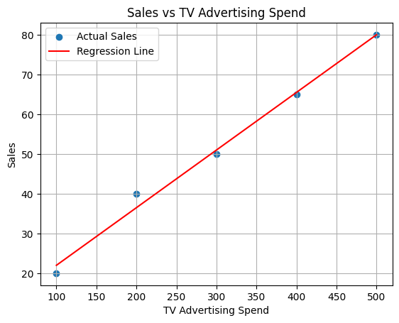

# Business Decisions Influenced by Regression Analysis

This notebook demonstrates how regression analysis can be used to support strategic business decisions, particularly in marketing and advertising.


```python
# Example: Impact of Advertising Spend on Sales using Linear Regression

import pandas as pd
import numpy as np
import matplotlib.pyplot as plt
from sklearn.linear_model import LinearRegression

# Sample dataset
data = {
    'TV_Ad_Spend': [100, 200, 300, 400, 500],
    'Sales': [20, 40, 50, 65, 80]
}
df = pd.DataFrame(data)

# Model training
X = df[['TV_Ad_Spend']]
y = df['Sales']
model = LinearRegression()
model.fit(X, y)

# Predictions
df['Predicted_Sales'] = model.predict(X)

# Visualization
plt.scatter(df['TV_Ad_Spend'], df['Sales'], label='Actual Sales')
plt.plot(df['TV_Ad_Spend'], df['Predicted_Sales'], color='red', label='Regression Line')
plt.xlabel('TV Advertising Spend')
plt.ylabel('Sales')
plt.title('Sales vs TV Advertising Spend')
plt.legend()
plt.grid(True)
plt.show()

```


    

    

