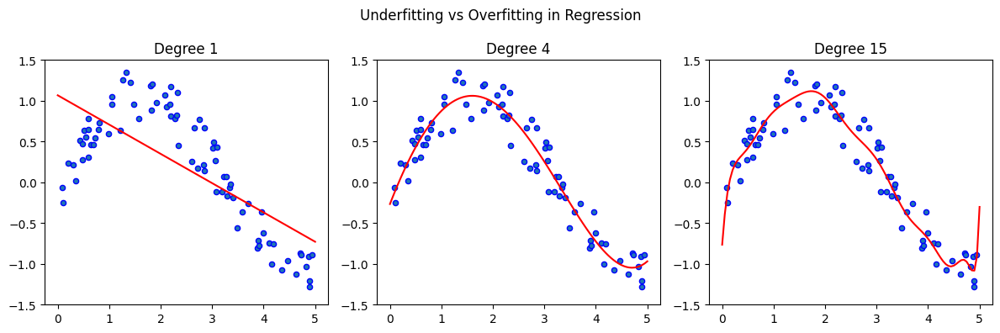

# Understanding Underfitting and Overfitting in Regression

This notebook visually demonstrates underfitting and overfitting using polynomial regression models on synthetic data.


```python
# Example: Underfitting vs Overfitting with Polynomial Regression

import numpy as np
import matplotlib.pyplot as plt
from sklearn.linear_model import LinearRegression
from sklearn.preprocessing import PolynomialFeatures
from sklearn.pipeline import make_pipeline

# Generate synthetic data
np.random.seed(0)
X = np.sort(5 * np.random.rand(80, 1), axis=0)
y = np.sin(X).ravel() + np.random.normal(0, 0.2, X.shape[0])

# Models: Linear (underfit), Polynomial degree 15 (overfit), Polynomial degree 4 (optimal)
degrees = [1, 4, 15]
plt.figure(figsize=(12, 4))

for i, d in enumerate(degrees, 1):
    model = make_pipeline(PolynomialFeatures(degree=d), LinearRegression())
    model.fit(X, y)
    X_test = np.linspace(0, 5, 100).reshape(-1, 1)
    y_pred = model.predict(X_test)

    plt.subplot(1, 3, i)
    plt.scatter(X, y, edgecolor='b', s=20)
    plt.plot(X_test, y_pred, color='r')
    plt.title(f"Degree {d}")
    plt.ylim(-1.5, 1.5)

plt.suptitle('Underfitting vs Overfitting in Regression')
plt.tight_layout()
plt.show()

```


    

    

