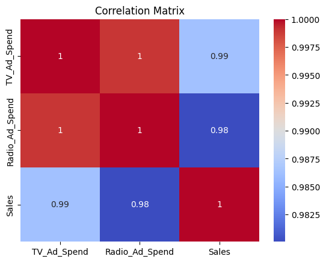

# Handling Multicollinearity in Regression Models

This notebook demonstrates how to detect and handle multicollinearity using VIF (Variance Inflation Factor) and correlation analysis.


```python
# Example: Detecting and Handling Multicollinearity

import pandas as pd
import seaborn as sns
import matplotlib.pyplot as plt
from statsmodels.stats.outliers_influence import variance_inflation_factor
from statsmodels.tools.tools import add_constant

# Sample data with multicollinearity
data = {
    'TV_Ad_Spend': [100, 200, 300, 400, 500],
    'Radio_Ad_Spend': [90, 180, 290, 390, 510],  # Highly correlated with TV_Ad_Spend
    'Sales': [20, 45, 60, 70, 85]
}
df = pd.DataFrame(data)

# Correlation matrix
sns.heatmap(df.corr(), annot=True, cmap='coolwarm')
plt.title('Correlation Matrix')
plt.show()

# Calculate VIF
X = add_constant(df[['TV_Ad_Spend', 'Radio_Ad_Spend']])
vif_data = pd.DataFrame()
vif_data["feature"] = X.columns
vif_data["VIF"] = [variance_inflation_factor(X.values, i) for i in range(X.shape[1])]
print(vif_data)

```


    

    


              feature         VIF
    0           const   17.000000
    1     TV_Ad_Spend  480.347826
    2  Radio_Ad_Spend  480.347826
    
